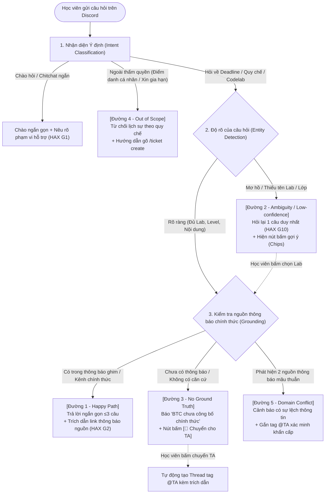

# ĐẶC TẢ LUỒNG HOẠT ĐỘNG & GIAO TIẾP DỮ LIỆU — CHECKPOINT 2
> **Dự án:** Trợ lý Học viên Discord (Track B1) — Nhóm LacHong  
> **Người thực hiện:** Trần Phạm Thái Vũ (Mã HV: `2A202602695`) — Role: Data & Evaluation Lead  
> **Phối hợp:** Vũ Duy Điệp (Core AI) & Võ Phú Hãn (UI/Prototype)  
> **Mục tiêu:** Cung cấp sơ đồ luồng bấm được, kịch bản 4 đường đi và chuẩn dữ liệu JSON để tích hợp prototype.

---

## 1. SƠ ĐỒ LUỒNG TỔNG THỂ (MERMAID FLOWCHART)

Sơ đồ này mô tả toàn bộ hành vi của Trợ lý Discord khi nhận câu hỏi từ học viên, bao gồm cơ chế kiểm tra căn cứ (Strict Grounding), thu hẹp phạm vi (Clarification) và chuyển giao (TA Handoff):



---

## 2. CHI TIẾT 4+1 ĐƯỜNG ĐI CỦA TRẢI NGHIỆM (`spec.md §6`)

### Đường 1: Happy Path (Thông tin rõ ràng, có nguồn chính thức)
* **Ngữ cảnh:** Học viên hỏi thời hạn bài tập đã có thông báo chính thức.
* **Input mẫu:** *"Hạn nộp Lab 2 CVAT là khi nào vậy bot?"*
* **Cơ chế xử lý:** AI trích xuất thực thể `Lab 02 CVAT`, đối chiếu kho thông báo thấy tin ghim ngày 13/09.
* **Output hiển thị:**
  > *"Hạn nộp **Lab 02 (CVAT)** là **23:59 ngày 16/09/2026** trên hệ thống VLearn.*  
  > *📌 Nguồn: Thông báo ghim của BTC tại kênh `#thong-bao-chung` ([Link tin nhắn](https://discord.com))"*
* **Hành động tiếp theo:** Học viên nhận thông tin chuẩn, không cần hỏi thêm.

---

### Đường 2: Ambiguity / Low-confidence (Mơ hồ / Thiếu thực thể — Lớp ②)
* **Ngữ cảnh:** Học viên hỏi cộc lốc hoặc thiếu thông tin bài lab.
* **Input mẫu:** *"Hạn nộp bài là mấy giờ vậy ạ?"*
* **Cơ chế xử lý:** AI nhận diện ý định là hỏi deadline nhưng thiếu thực thể (Entity: `lab_id`). Áp dụng nguyên tắc **HAX G10** (Thu hẹp phạm vi).
* **Output hiển thị:**
  > *"Bạn đang cần tra cứu hạn nộp của nội dung nào? Hãy chọn nhanh bên dưới nhé:"*  
  > `[🔘 Lab 01 Codelab]` `[🔘 Lab 02 CVAT]` `[🔘 Ghép đội tự do]`
* **Hành động tiếp theo:** Học viên bấm nút chọn bài → Hệ thống chuyển ngay vào **Đường 1**.

---

### Đường 3: Failure / No Ground Truth (Chưa công bố / Không có nguồn — Lớp ①)
* **Ngữ cảnh:** Học viên hỏi hạn nộp của bài học tuần sau mà BTC chưa ra thông báo (ví dụ Lab 4).
* **Input mẫu:** *"Hạn nộp Lab 4 là ngày mấy?"*
* **Cơ chế xử lý:** AI quét kho thông báo → Trả về kết quả rỗng. Cơ chế Strict Grounding chặn hoàn toàn việc tự suy đoán.
* **Output hiển thị:**
  > *"Hiện tại BTC **chưa công bố thời hạn chính thức cho Lab 4**. Để tránh bạn nhận thông tin suy đoán sai lệch, bot không tự đưa ra deadline.*  
  > *Bạn có muốn gửi câu hỏi này tới đội ngũ TA không?"*  
  > `[🔴 Chuyển cho TA hỗ trợ]`
* **Hành động tiếp theo:** Nếu bấm nút, bot tự tạo thread riêng tag `@TA` kèm trích dẫn câu hỏi gốc của học viên.

---

### Đường 4: Out of Scope (Ngoài thẩm quyền can thiệp — Lớp ③)
* **Ngữ cảnh:** Học viên nhờ bot kiểm tra trạng thái cá nhân hoặc xin đặc cách.
* **Input mẫu:** *"Check xem t đã nộp bài codelab chưa"* (Case M84993) hoặc *"Cho em xin gia hạn nộp bài thêm 1 tiếng vì mất điện"*.
* **Cơ chế xử lý:** AI phân loại ý định thuộc nhóm "Dữ liệu cá nhân / Thẩm quyền BTC". Áp dụng nguyên tắc **HAX G11** (Giải thích lý do từ chối).
* **Output hiển thị:**
  > *"Trợ lý không có quyền truy cập dữ liệu cá nhân của học viên hoặc cấp quyền gia hạn nộp bài.*  
  > *👉 Để kiểm tra bài nộp: Bạn xem trực tiếp tại trang cá nhân trên VLearn.*  
  > *👉 Để xin hỗ trợ đặc biệt: Vui lòng gõ lệnh `/ticket create` tại kênh `#ticket-support` để BTC giải quyết."*
* **Hành động tiếp theo:** Học viên được điều hướng đúng kênh giải quyết thay vì nhận câu trả lời dông dài, lạc đề (khắc phục triệt để lỗi của bot hiện tại ở case M84993).

---

### Đường 5: Domain Conflict (Mâu thuẫn thông báo — Lớp ④ Đặc thù)
* **Ngữ cảnh:** Có 2 mốc thời gian khác nhau (ví dụ: Email thông báo 23:59 nhưng Discord ghim 18:00).
* **Input mẫu:** *"Em thấy email bảo hạn 23h59 nhưng discord ghi 18h00 thì theo cái nào?"*
* **Cơ chế xử lý:** Nhận diện xung đột thông tin giữa các kênh.
* **Output hiển thị:**
  > *"⚠️ **Cảnh báo xung đột thông tin:** Hệ thống ghi nhận có 2 mốc deadline khác nhau giữa Email và Discord. Bot đã chuyển cờ ưu tiên tới @TA để đính chính thông tin chính thức sớm nhất cho bạn."*

---

## 3. CHUẨN KẾT NỐI DỮ LIỆU I/O (JSON CONTRACT CHO BẠN ĐIỆP & BẠN HÃN)

Để Vũ Duy Điệp (Backend) và Võ Phú Hãn (Frontend) làm việc khớp 100%, payload trao đổi giữa hai bên tuân theo định dạng chuẩn sau:

### Request (Frontend gửi lên Backend):
```json
{
  "user_id": "D202602695",
  "channel_id": "channel_10",
  "message_text": "Hạn nộp bài là mấy giờ vậy ạ?",
  "timestamp": "2026-09-16T19:40:00Z"
}
```

### Response (Backend trả về Frontend):
```json
{
  "intent": "query_deadline",
  "status": "clarification_needed",
  "confidence_score": 0.55,
  "reply_text": "Bạn đang cần tra cứu hạn nộp của nội dung nào? Hãy chọn nhanh bên dưới nhé:",
  "source_citation": null,
  "interactive_elements": {
    "type": "chips",
    "options": [
      {"label": "Lab 01 Codelab", "value": "hạn nộp lab 1"},
      {"label": "Lab 02 CVAT", "value": "hạn nộp lab 2"},
      {"label": "Ghép đội tự do", "value": "hạn ghép đội"}
    ]
  },
  "handoff_metadata": {
    "need_ta": false,
    "reason": null
  }
}
```

*Trường hợp Cần chuyển TA (`status: "ta_handoff"`):*
```json
{
  "intent": "query_deadline_unannounced",
  "status": "ta_handoff",
  "confidence_score": 0.1,
  "reply_text": "Hiện tại BTC chưa công bố thời hạn chính thức cho Lab 4. Để tránh thông tin sai lệch, bot không đưa ra suy đoán.",
  "source_citation": null,
  "interactive_elements": {
    "type": "button_handoff",
    "options": [
      {"label": "🔴 Chuyển cho TA hỗ trợ", "action": "trigger_ta_handoff"}
    ]
  },
  "handoff_metadata": {
    "need_ta": true,
    "reason": "no_official_ground_truth"
  }
}
```

---

## 4. DỮ LIỆU MẪU (MOCK FIXTURES) DÙNG CHO PROTOTYPE CP2

Võ Phú Hãn (Người 4) dùng trực tiếp 4 kịch bản này để làm Mockup bấm được:

| Kịch bản | Câu hỏi của User | Trạng thái hiển thị trên giao diện Discord Mock |
|---|---|---|
| **Case 1: Happy Path** | `@Trợ lý Hạn nộp Lab 2 CVAT là khi nào?` | Trả lời: `23:59 ngày 16/09/2026` + Khối Embed trích dẫn tin ghim. |
| **Case 2: Mơ hồ** | `@Trợ lý Hạn nộp bài là mấy giờ?` | Hỏi lại + 3 nút bấm (Lab 1, Lab 2, Ghép đội). Bấm nút nào nhảy tiếp câu trả lời bài đó. |
| **Case 3: Chưa có nguồn** | `@Trợ lý Hạn nộp Lab 4 là ngày nào?` | Báo chưa công bố + Hiện nút màu đỏ `[Chuyển cho TA]`. Bấm vào hiện toast: *"Đã tag @TA vào thread hỗ trợ"*. |
| **Case 4: Ngoài quyền hạn** | `@Trợ lý check xem t đã nộp bài codelab chưa` | Báo không có thẩm quyền + Nút hướng dẫn mở `/ticket create`. |
