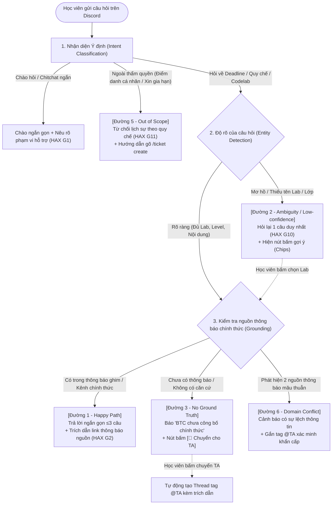

# SƠ ĐỒ LUỒNG HOẠT ĐỘNG — TRỢ LÝ HỌC VIÊN DISCORD (CP2)
> **Dự án:** Trợ lý Học viên Discord (Track B1) — Nhóm LacHong (Lớp 3A)  
> **Tác giả:** Trần Phạm Thái Vũ (Mã HV: `2A202602695`) — Data & Evaluation Lead  

---

## 1. SƠ ĐỒ LUỒNG TỔNG THỂ (MERMAID FLOWCHART)

---

## 2. TÓM TẮT CÁC ĐIỂM DỪNG TƯƠNG TÁC (INTERACTION NODES)

| Nút xử lý | Ý nghĩa nghiệp vụ | Nguyên tắc HAX/PAIR áp dụng |
|---|---|---|
| **R0 (Chào hỏi)** | Phản hồi chào mừng và nêu rõ giới hạn: chỉ hỗ trợ tra cứu deadline & quy chế nộp bài chính thức. | **HAX G1** (Làm rõ hệ thống làm được gì) |
| **R1 (Happy Path)** | Trả lời ngắn gọn $\le$ 3 câu, luôn kèm theo khối Embed dẫn chứng link thông báo ghim. | **HAX G2** (Làm rõ hệ thống làm tốt đến đâu) |
| **R2 (Mơ hồ)** | Không tự suy đoán bừa bãi; hỏi lại 1 câu duy nhất kèm các chips lựa chọn (`Lab 01`, `Lab 02`, `Ghép đội`). | **HAX G10** (Thu hẹp phạm vi khi không chắc) |
| **R3 (Ngoài quyền)** | Từ chối lịch sự do giới hạn quyền truy cập dữ liệu cá nhân; hướng dẫn học viên gõ `/ticket create`. | **HAX G11** (Giải thích lý do từ chối) |
| **R4 (Chưa công bố)** | Báo rõ "BTC chưa công bố thông tin chính thức", hiển thị nút `[🔴 Chuyển cho TA hỗ trợ]`. | **PAIR** (Errors & Graceful Failure) |
| **R5 (Xung đột nguồn)** | Nhận diện mâu thuẫn giữa các kênh (Email vs Discord), cảnh báo học viên và gắn cờ ưu tiên cho TA. | **Đặc thù domain** (Conflict Handling) |
